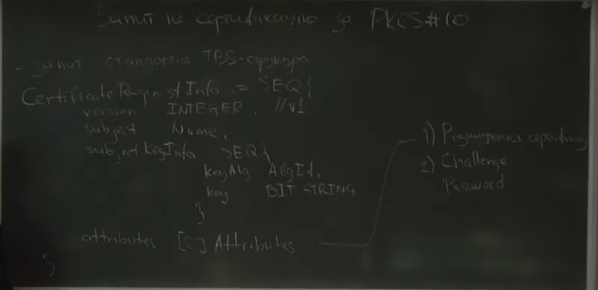
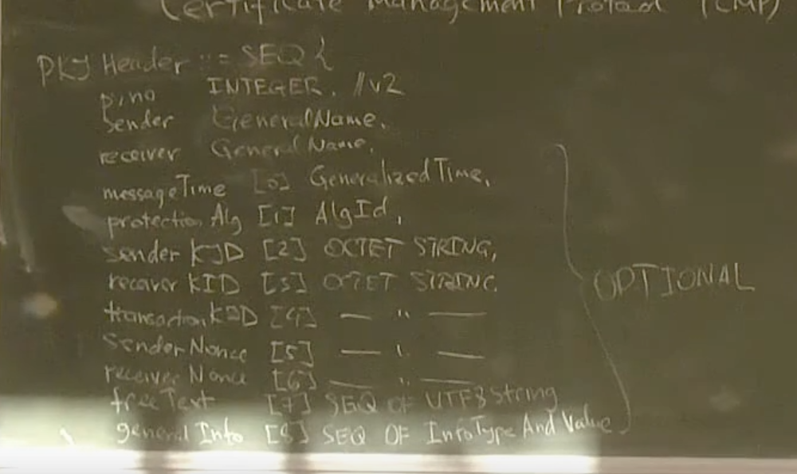
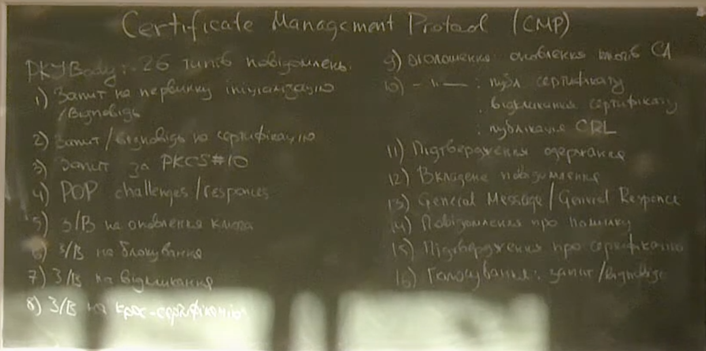
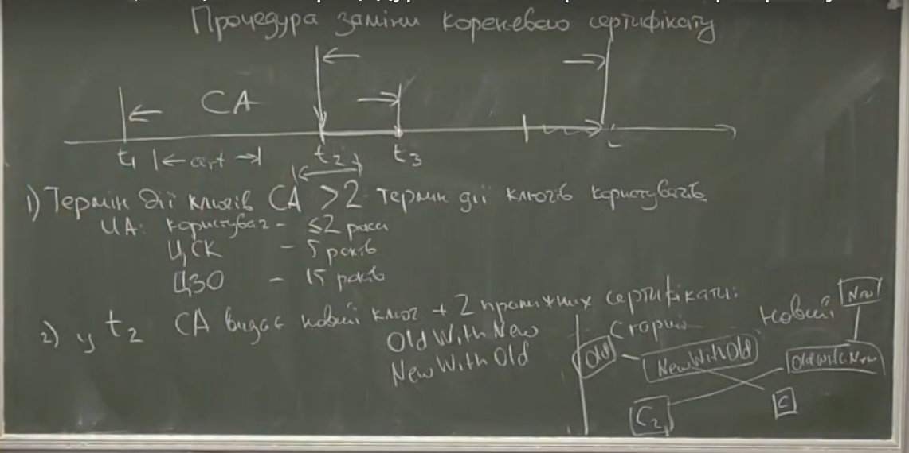

# Лекція 10
## 10-1: формат запиту на сертифікацію за PKCS#10

TBS -- to be signed

CertificateRequestInfo := SEQ{
    version INTEGER, //v1 \
    subject Name, //і'мя користувача\
    subjectKeyInfo  SEQ{\
        keyAlg AlgId,\
        key BITSTRING\
    }\
    attributes [0]Attributes\
}

1. розширення сертифіката, які задає користувач
2. Chalange password (дані які вказав користувач, як парольний захист)

## 10-2: протокол керування сертифікатами CMP
RFC 4210\
+RFC 4211 (Crtificate Request Message Format, CRMF)

**Сутності**

1. Кореневий центр
2. інші ЦСК
3. центри реєстрації 
4. end entities

**Функціонал**

1. Інінціалізація rootCA
2. додавання нового CA
3. первинна ініціалізація EE
4. операції над сертифікатом
    * первинна реєстрація
    * оновлення ключа
    * оновлення сертифікату без заміни ключа
    * оновлення ключа ЦСК
    * запит на крос-сертифікацію
    * оновлення крос-сертифікатів
5. публікування відомостей
    * розсилання сертиікатів
    * розсилання CRL
6. відновлення секретного ключа
7. відкликання та поновлиння сертифікатів
8. доведення володіння секретним ключем
    * ключі ЕЦП
    * ключі шифрування
    * для схем узгодження ключів за схемою Діффі-Хелмана

PKIMessages := SEQ oF PKIMessage;

PKIMessage := SEQ {
    header PKIHeader,\
    body PKIBody,\
    protection [0] PKIProtection OPT,\
    extraCerts [1] SEQ OF CMPCertifications OPT // додаткові сертифікати
}

PKIHeader := SEQ {
    pvno INTEGER //v2 pvno -- pki version number,\
    sender GeneralName,\
    receiver GeneralName,\
    messegeTime [0] GeneralizedTime,\
    protectionAlg [1] AlgId,\
    senderKID [2] OCTETSTRING,// KID -- key ID\
    receiverKID [3] OCTETSTRING,\
    transactionKID [4] --/--,\
    SenderName [5] --/--,\
    ReceiverName [6] --/--,\
    freeText [7] SEQ OF UTF8String,\
    generalInfo [8] SEQ OF InfoTypeArdValue // службова інформація\
}

PKIBody

## 10-3: процедура заміни кореневого сертифікату
 

Дана процедура для зменшення навантаження на ЦСК при заміні кореневого сертифікату

1. Термін дії ключів CA має бути в двічі бвльший ніж термін дії користувацьких ключів
2. у t2 CA видає новий ключ і два проміжні сертифікати: OldWithNew, NewWithOld\
після чого знищується старий ключ\
OldWithNew -- містить старий ключ і підписаний новим ключем\
NewWithOld -- містить новий ключ і підписаний старим\
(проміжок часу t3 - t2 >= термін дії користувацького сертифіката)

В такому разі усі користувачі отримають нові сертифікати підписані новим ключем 
CA протягом періоду [t2,t3], а не в момент t3

Але в такому разі у нас є користувачі які мають сертифікати підтверджені старим ключем CA і користувачі із сертифікатами підтверджиними новими ключами CA

Аби вони могли взаємодіяти і створені сертифікати OldWithNew, NewWithOld

тобто сертифікат нового користувача $C_N$ для старого користувача підтверджується 
сертифікатом NewWithOld