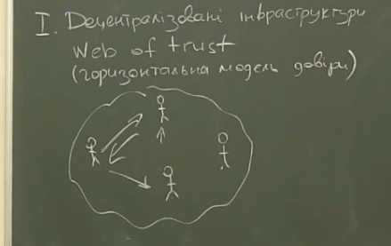
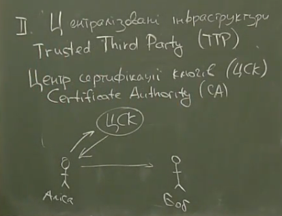
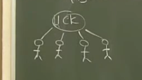
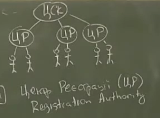
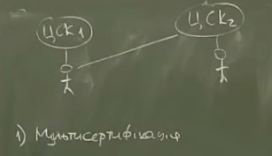
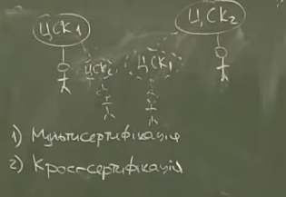
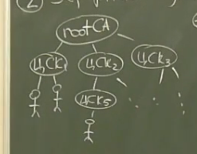
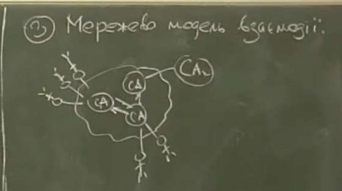
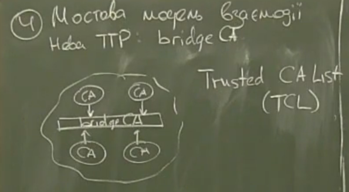

# Лекція 2
## 02-1: децентралізовані та централізовані інфраструктури

**Класифікація PKI**

### **I Децентралізовані інфраструктури** 
(Web of trust) \
(горизонтальна модель довіри)

Кожен може взаємодіяти з кожним\
Кожна пара сама встановлює механізми захисту, рівні довіри, механізми перевірки

**Переваги:**
+ просто
+ дешево 
+ еластичність 
+ кожен суб'єкт виступає точкою довіри
+ кожен сам визначає механізми захисту

**Недоліки:**
- усі користувачі мають бути обізнанні у сфері інформаційній безпекі
- сфера застосування: обмін приватними повідомленнями (документами)
- відсутнє юридичне значення дій

### **II Цецентралізовані інфраструктури**

**Trusted Third Party (TTP)** --- спеціальний користувач, якому всі інші користувачі делегують повноваження 

Центр сертифікаціїї ключів (ЦСК) //як би здавалося, а при чому тут футбол? 
   
Certeficate Authority (CA)

**Переваги:**
+ Єдині правила для усіх ($\Rightarrow$юридична значемість за необхідності)
+ розвантаження користувачів
+ автоматизація процесів

**Недоліки:**
+ дороговизна (витрати на організацію і експлуатацію)
+ втрата гнучкості
+ ускладнення системи

---

##  02-2: однорангові домени

### **Топології PKI**

1. Одноранговий домен (ізольовани ЦСК)\
    
    // навіщо ми вішаємо фанатів ЦСК?

    **Переваги**
    + найбільш проста

    **Недоліки**
    - єдина точка вразливості
    - усі користувачі мають однакові права (можна ввести правила отримання сертифікатів різних рівнів [політика сертифікацій])
    - ЦСК повинен бути постійно доступний (багато користувачів $\Rightarrow$ велике навантаження)

    \
    **Центр Реєстрації (ЦР)** --- особа якій ЦСК делегує свої повноваження із реєстрації і аутентифікації користувачів\
    **Registration Authority (RA)**

[Багаторангові домени]

1. Мультисертифікація (коли користувач свій ключ [який уже сертифіковано у $ЦСК_1$] сертифікує у $ЦСК_2$) --- можна, але не можна, а то інакше Сенсей або життя може зробити вам боляче. Ня?\
    \

2. Кроссертифікація (створюємо ланцюжок довіри [інший ЦСК робимо своїм клієнтом])\
    
    - проблеми з узгодженням політик ЦСК

3. Модель списків довіри (маємо перелік довірених ЦСК, якщо отриманий сертифікат проходить перевірку хоча б в одному ЦСК із списка, то ми можемо довіряти даному сертифікату)

---

## 02-3: ієрархічна, мережева та мостова моделі взаємодії

1. Ієрархічна модель сертифікації \
    

    **Переваги**
    + простота
    + max захист на корінь 
    + просто включати/відключати гілки
    + можна організувати розподіл прав

    **Недоліки**
    - ще витратніше 
    - ще більше втрачаємо гнучкість
    - організаційна складність
    - монополізація послуг
    - складність верифікаціїї кореня

2. Мережева модель взаємодії\
    

    **Переваги**
    + простота встановлення довіри
    + гнучкість зберігається
    + компрометація одного ЦСК недуже болюче
    + відновлення просте

    **Недоліки** 
    - проблеми узгодження політик ЦСК
    - слабка зв'язність

3. Мостова модель взаємодії (youtube ~28:00)
    