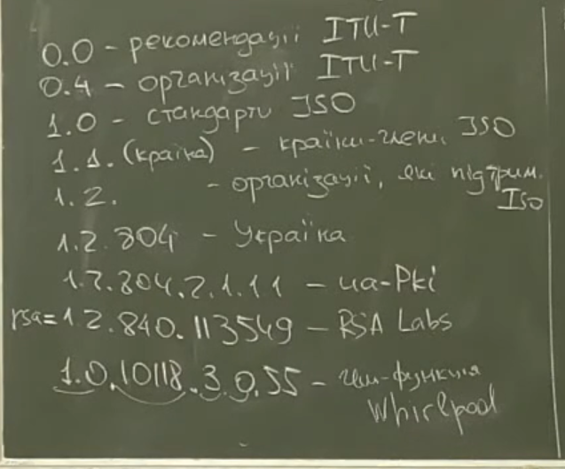

# Лекція 3
## 03-1: Abstract Syntax Notation One (ASN.1)

**Типи даних AS1**
- універсальні
- застосункові
- контекстні
- приватні
------------------
- прості (атомарні)
- складнені

**Базові типи**
* BOOLEAN
* INTEGER 
* ENUMERATED
* REAL // "для чего я создан?"
* BITSTRING
* OCTETSTRING
* NULL

**Типи рядків**
* NumericString // [\d_]
* PrintebleString // [\w\s]
* TeletexString // [\w\s(+ кер символи)]
* VideotexString // [\w\s(+ кер символи)]
* IASString // [\w@]
* GraphicString
* VisibleString (ISO 10646) (не все що можна побачити є VisibleString)
    > ISO 10646 : Видиш символ?\
    > Я: Вижу.\
    > ISO 10646: И я вижу. А его нет.\
    > Я: Понял.
* GeneralString
* UniversalString (unicode)
* UTF8String 
* BMPString (перші 64 байти юнікода)

**Спецефічні типи даних**
1. Об'єктні ідентифікатори (OBJECT IDENTIFIER)

    a.b.NN.NN....

    a $\in \{0, 1, 2\}$

    a = 0 --- ідентифікатор ITU-T
    
    a = 2 --- ідентифікатор ISO

    a = 3 --- ідентифікатор ITU-T i ISO

    b $\in \{0, \ldots, 40\}$ 
    **приклади**
    

2. Час
    * UTCTime : YYMMDDhhmm[ss]Z $\pm$ hhmm
        - YY = 0..49 - 20YY
        - YY = 50..99 - 19YY
    * GeneralizedTime : YYYYMMDDhhmmss[.ss]Z $\pm$ hhmm (ISO 8601)

---

## 03-2: Abstract Syntax Notation One (ASN.1)

1. SEQUENCE  --- послідовність довільних об'єктів (порядок важливий)
    SEQUENCE OF Type --- послідовність однорідних об.
2. SET  --- множини ASN-об (порядок не важливий)
    SET OF Type
3. Варіативний тип
    CHOISE {Type1, Type2, ...}

    Time ::= CHOISE { UTCTime, GenerelisedTime}

        Наступний приклад є некоректним, оскільки компілятор не знає який INTEGER потрібно вибрати
        Height ::= CHOISE{ hS INTEGER, hI INTEGER}

    Height ::= CHOISE{ hS [0] INTEGER, hI[1] INTEGER}

> ***Контекстний тип*** \
> NNN [N]  INTEGER
>
> IMPLICIT: [N] підмінює тип даних\
> EXPLICIT: [N] включає як значення інший тип

**Модифікатори**
1. OPTIONAL (вказує не обов'язкові поля)
2. DEFAULT (вказує значення по замовчуванню)
3. SIZE (вказує значення для INT, довжини SEQUENCE, розміри SEQ i SET)
4. ANY --- довільний тип даних