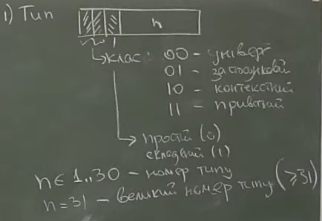
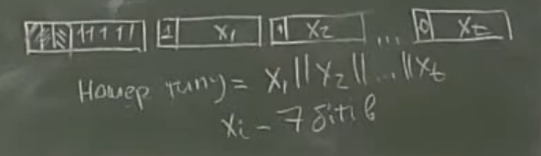
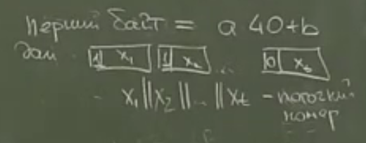
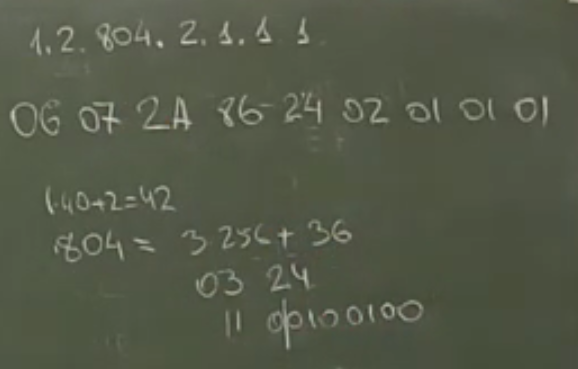
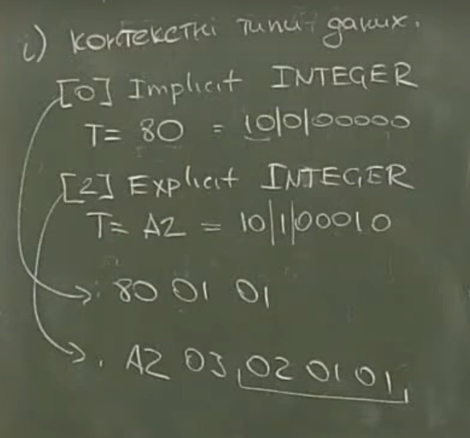

# Лекція 4
## 04-1: правила кодування ASN.1 (BER, CER, DER) 

TLV-кодування [tag-length-value]

1. Тип\
    розглядаємо байт представлений, як Litle Endian

    * перші два біта у строкі вказують на клас типу даних
    * третій біт вказує чи є цей тип простим або складеним 
    * остані 5 біт кодують номер типу (n)

    
    > n $\in \{1, \ldots, 30\}$ номер типу \
    > n $\ge 31$ великий номер типу
    > 
    > якщо кодування типу перевищує розмір одного байта, то дозволяється використовувати
    довільну кількість байт. Де в першому байті на місці бітів, які кодують номер типу стоять одиниці, а всі наступні байти мають старшим бітом 0, якщо це останій біт який потрібен для кодування типу, і 1 в іншому випадку. Номером типу буде число яке утворене конкатенацією бітів у яких відсутня службова інформація
    > 

2. Довжина (поля value) (довжина вказується у байтах)\
    * якщо довжина $\le 127$ тоді достатньо одного байта для кодування довжини (для таких чисел
    старший біт рівен 0, і це вказує на коротку довжину)
    * якщо довжина $\ge 128$ тоді старший біт встановлюється, як 1, що вказує на велику довжину value 
        * якщо наступні 7 біт вказують на число від 1 до 126, тоді це число означає скільки наступних 
        байт колдують довжину value
        * якщо наступні 7 біт вказують на число 127 (це зарезервоване значення)
        * -/- 0, тоді довжина не визначена

3. Value
    * BOOLEAN 
        * T = 01
        * L = 01
        * V = 00 -> False, V $\ne$ 00 True
    * INTEGER 
        * T = 02
        * старший біт знак
        > i = 127 $\Rightarrow$ 02 01 7F \
        > i = 128 $\Rightarrow$ 02 02 00 80\
        > i = -128 $\Rightarrow$ 02 01 80
    * BITSTRING 
        * T=03 
        * перший байт value вказує на кількість біт які не використовуються у останьому байті строки
        * дані MSB-потік бітів (від старших до  молодших)
        > s = "01" $\Rightarrow$ 03 02 06 40
    * OCTETSTRING 
        * T = 04

                як кодується невиначена довжина (youtube ~30:15)
    * NULL 
        * T = 05
        * L = 00
    * ENUMERATED
        * T = 0A
        * кодується як INTEGER
    * Рядки 
        * UTF8String
            * T = 0C 
    * UTCTime 
        * T = 17
        * кодується як *STRING
    * GeneralisedTime 
        * T = 18
        * кодується як *STRING
    * OBJECT IDENTIFIER
        * T = 06
        \
        
    * SEQUENCE 
        * T = 30
    * SET 
        * T = 31
    * Контекстні типи даних  #! розпиши
        

---

## 04-2: особливості CER- та DER-кодування

**CER**  потрібен для оптимізації кодування

**DER** потрібен аби зробити кодування однозначним

* False = 00 \
    True = FF \
    усі інші біти заборонено 
* У BIT STRING біти що не використовуються мають бути занулені
* Поля із DEFAULT обов'язково пропускають
* SET OF -- має кодуватись у лексикографічному порядку закодованих значень
* довжини
    * CER: для складених типів довжина може бути невизначеною, для інших ні
    * DER: забороняє невизначені довжини
* рядки
    * CER: для рядків < 1000 сим -- має бути визначена довжина, для $\ge 1000$ сим можна невизначену довж, але шматками довжини $\ge 1000$ сим
    * DER: лише визн довж
* SET -- кодування по тегах у порядку зростання
    * CER: за описом структури 
    * DER: за фактично закодованими елементами