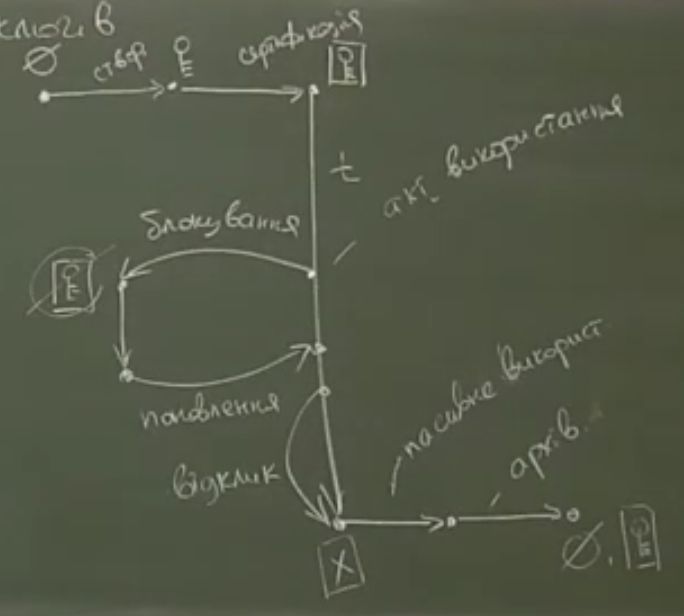

# Лекція 5
## 05-1: життєвий цикл криптографічних ключів

0. Безвидне ніщо
1. Створення ключової пари
1. Сертифікація
    * ЦСК видає сертифікат та визначає повноваження ключа
1. Поширення 
1. Активна фаза
1. Фаза пасивного використання
1. Завершення терміну дії сертифіката 
    - секретний ключ знищується
    - відкритий ключ передається у архів

**Регламентні процедури**
1. Сертифікація
2. Повторна сертифікація (тойсамий користувач, але новий ключ)
3. Блокування (запит на блокування може надіслати третя особа)
4. Поновлення
5. Відклик
6. Перевірка статусу сертифіката
7. Вивід з дії
8. Заміна кореневого сертифікату

---

## 05-2: класифікація сертифікатів відкритих ключів

**Класифікація сетрифікатів відкритих ключів**

1. Сертифікати ЦСК
    * самопідписані (root CA)
    * звичайні
2. Сертифікати користувачів
    * користувачі -- особи
    * користувачі -- системи (VPN, SSL, пристрої) (трохи відрізняється політикою сертифікації, що дозволяє подовжити тривалість дії сертифіката)

---

## 05-3: формат сертифікатів відкритих ключів X.509v3

>Certificate ::= SEQ{\
>    tbsCreteficate TBSCertificate,\
>    signAlg AlgorithmIdent, \
>    sign BIT STRING\  
>}

>TBSCerteficate ::= SEQ{\
>    version [0] INTEGER, -- v=3\
>    SerialNumber INTEGER (SIZE(0,20)), // ідентифікатор в межах одного ЦСК\
>    signAlg AlgId,\
>    issuer Name, // +SerialNumber ідентифікатор серед всіх ЦСК\
>    validity SEQ {\
>        notBefore Time,\
>        notAfter Time,\
>    },\
>    subject Name, \
>    subjectPubliKey SEQ {\
>        keyAlg AlgId,\
>        key BIT STRING\
>    },\
>[кінець полів для сертифіката першої версії]\
>    issuerUniqueId [1] IMPLICIT OCTET STRING OPTIONAL,\
>    subjectUniqueId [2] IMPLICIT OCTET STRING OPTIONAL,\
>[кінець полів для сертифіката другої версіїб ці поля не рекомендують використовувати]\
>    extensions [3] Extensions\
>
>}

Name ::= SEQ OF RDN 

RDN = relative distinguished Names 

RDN ::= SET OF Attribute

>Attribute ::= SEQ {\
>    type OID,\
>    value ANY DEFINED BY Type // зазвичай Direetory String (printeble, UTF8) \
>}

**Обов'язкові атрибути**
1. country (2.5.4.2) "UA"
2. commonName (2.5.4.3?)

Україна:

_для видавця_\
3. організація \
4. підрозділ \
5. область \
6. місто \
7. serialNumber

_для власника_\
3. ПІБ\
4. serialNumber (ІНН..)\
5. організація\
6. підрозділ \
7. місто\
9. область