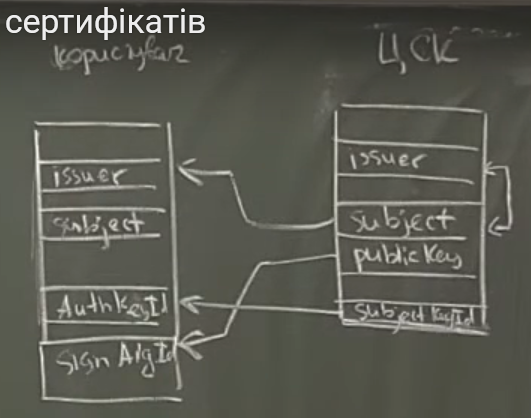

# Лекція 6
## 06-1: розширення сертифікатів
Extentions ::= SEQ OF Extension\
Extention ::= SEQ {\
    extId OID,\
    critical BOOLEAN DEFAULT FALSE,\
    value OCTET STRING\
}\
2.5.29.n

**Приклади розширень**
1. Сфера використання ключа
	KeyUsage, 2.5.29.15, critical == TRUE\
	BIT STRING:
	* 0 - чи використовується для ЕЦП
	* 1 - невідмовність (користувач не може відкликати підпис)
	* 2 - транспортування (шифрування) секретних ключів
	* 3 - шифрування даних
	* 4 - узгодження ключів (напр. у алгоритмі Д-Х)
 	* 5 - підписування сертифікатів
	* 6 - підписування списку відкликаних сертифікатів
	* 7 - ключ використовується лише для шифрування
	* 8 - лише для розшифування
Для ЦСК можуть бути встановлені лише біти 5 та 6.\
Для користувача - навпаки.\
Додаткове обмеження - рекомендація використання різних ключів для різних криптографічних задач. Тому, наприклад, біти 0 і 3 не можуть одночасно дорівнювати 1.

2. Розширення сфери використання ключа
	* Extended Key Usage, 2.5.29.37
	* ExtKeyUsage ::= SEQ OF OID

3. Політики сертифікації, 2.5.29.32, критичне, обов'язкове
	
+ відображення політик (policy mapping)
	узгоджує зовнішні політики з локальною

4. Додаткові імена власника (SubjectAltNames, 2.5.29.17) 
		і видавця (IssuerAttributes, 2.5.29.18)\
	General Name: 
    - пошта
    - URL
    - DNS
    - додаткові RDN
    - IP-адреса\
    ...

5. Ідентифікатор ключа власника (2.5.29.14), некритичне, обов'язкове в Україні\
	SubjectKeyIdentifier ::= OCTET STRING (наприклад перші 8 байтів гешу ключа)\
	строгих специфікацій цього поля немає

6. Ідентифікатор видавця (2.5.29.35), некритичне, обв'язкове в Україні
	>AuthorityKeyID ::= SEQ {\
	>    [0] KetID,\
	>    [1] GeneralNames OPTIONAL,\
	>    [2] CertSerialNumber OPTIONAL\
	>}
    
    

7. Базові обмеження
	Basic Constraints, 2.5.29.19, критичне, обов'язкове для ЦСК
	>BasicConstraints ::= SEQ {\
	>    isCA BOOLEAN DEFAULT FALSE,\
	>    pathLenConstraint INT OPTIONAL\
	>}

	Останнє поле потрібне за наявності дерева ієрархії ЦСК. Тоді значення цього поля вказує довжину шляху від даного ЦСК до кінцевого користувача.

8. SubjectDirectoryAttributes

9. Точка доступу до списку відкликаних сертифікатів (CRL Distribution Point)\
+Freshest CRL - точка доступу до дельта-СВС\
(список, у якому накопичуються найновіші відкликані сертифікати; раз на добу додається до загального списку)

---

## 06-2: посилені сертифікати

- підтверджує власника ключа із високим степенем надійності

**Властивості**:
1. видавець формулює твердження про надійність (відповідність сертифікату меті його     використання);\
    Твердження - спеціальне разширення або політика (у сучасних стандартах вимагається, щоб це була саме політика). В Україні посилені сертифікати можуть видавати лише акредитовані ЦСК.
2. політика сертифікації відповідає очікуванням;\
    В Україні це закріплено законодавчо.
3. ЦСК слідкує за тим, щоб усі імена користувачів були унікальними в межах видавця
	
	Далі є дві специфікації: RFC 3739 (3039), ETSI TS 101 892\
	Перший вимагає, щоб посилені сертифікати видавалися лише живим особам; другий - будь-яким.\ Україна прийняла за стандарт останню специфікацію.

---

## 06-3: формат посилених сертифікатів
ФОРМАТ ПОСИЛЕНОГО СЕРТИФІКАТА (Х.509v3)

- перелік обов'язкових імен власника та видавця
- перелік альтернативних імен (відсутнє в ETSI TS 101 892) як наприклад: дата народження, гендер, місце народження, місце проживання тощо.
- підтримка біометричної ідентифікації (знову тільки для фізичних осіб)
- підтримка тверджень безпеки (певна інформація, яка є важливою з точки зору оцінки ризиків безпеки)

Твердження про безпеку - спеціальне розширення QCStatements (Qual. Cert. St.)
1. даний сертифікат сформовано як посилений
(наразі не рекомендовано використовувати таке твердження для позначення посиленості сертифікату)
2. обмеження на розмір транзакцій
3. гарантійний термін зберігання інфомації про сертифікат після його відкликання
4. секретний ключ користувача зберігається на захищеному пристрої (SSCD)

В Україні діє політка сертифікації 1.2.804.2.1.1.1.2.2 : "Сертифікат сформовано згідно вимог Закону України про ЕЦП"
+додаткові політики ЦСК\
Твердження безпеки (не рекомендоване до використання): 1.2.804.2.1.1.1.2.1
